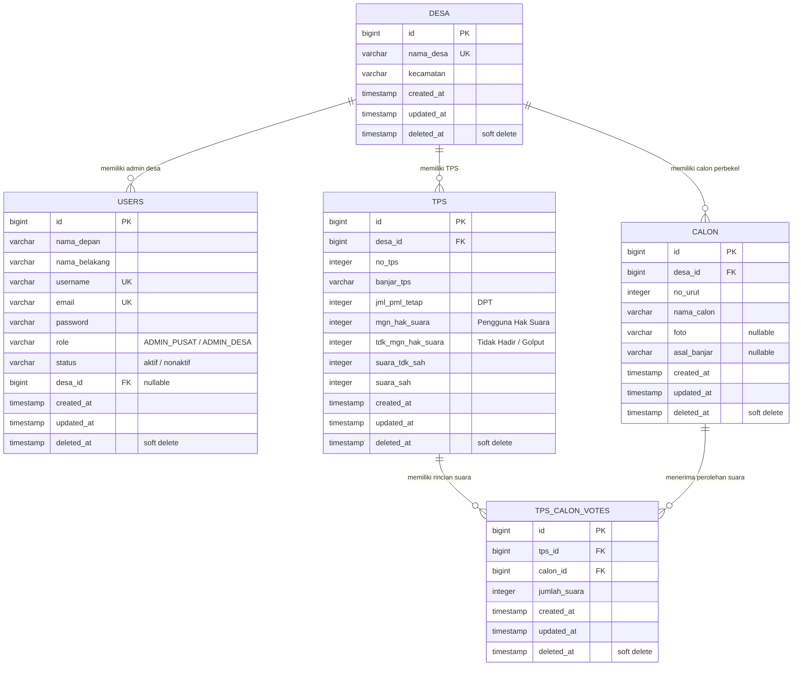

# PRODUCT REQUIREMENT DOCUMENT (PRD)
# BACKEND SIDAPILKEL (SISTEM INFORMASI DATA PEMILIHAN PERBEKEL)
## ACUAN LENGKAP MIGRASI & KONVERSI KE LARAVEL (BERSTANDAR BEST PRACTICES)

---

## 1. PENDAHULUAN & RINGKASAN EKSEKUTIF

### 1.1 Latar Belakang Sistem
**SIDAPILKEL** (Sistem Informasi Data Pemilihan Perbekel) adalah aplikasi backend berbasis web yang dibangun untuk mengelola, merekam, memvalidasi, dan menyajikan hasil rekapitulasi pemilihan kepala desa (Perbekel) di Kabupaten Tabanan, Bali.

Backend saat ini dibangun menggunakan bahasa pemrograman **Go (Golang 1.24)** dengan framework **Fiber v2**, **GORM ORM**, database **PostgreSQL**, caching **Redis**, dan penyimpanan berkas foto calon via **Supabase Storage / Local Storage**.

### 1.2 Tujuan Dokumen PRD
Dokumen ini disusun sebagai **spesifikasi teknis dan fungsional 100% lengkap** dari backend yang ada. Dokumen ini menjadi acuan mutlak bagi tim pengembang untuk melakukan rewrite/migrasi ke **Laravel 11+ (PHP 8.2+)** agar kode aman, terstruktur, mudah diuji (*testable*), memiliki performa optimal, dan mudah dirawat.

### 1.3 Target Arsitektur Konversi (Berdasarkan 10 Standar Best Practices)
1. **Resourceful Routing**: Mengutamakan `Route::apiResource()` untuk modul-modul CRUD (Users, Desa, Calon, TPS).
2. **Form Request Validation**: Seluruh validasi input dipusatkan pada class `FormRequest` tersendiri. Controller terbebas dari validasi manual.
3. **API Resource Transformation**: Seluruh respon menggunakan `JsonResource` / `ResourceCollection` untuk memformat data, menyembunyikan field sensitif, dan menjaga casing `snake_case`.
4. **Autentikasi & Otorisasi Jelas**: Menggunakan **Laravel Sanctum** untuk token authentication serta **Laravel Policies & Gates** untuk membatasi hak akses tingkat data (*multi-tenant desa*).
5. **Penanganan Error Konsisten**: Format JSON error seragam (`message` dan `errors`) dengan status code HTTP RESTful standar (`200`, `201`, `400`, `401`, `403`, `404`, `422`, `429`, `500`).
6. **Pagination Standar pada List**: Menggunakan `$query->paginate()` yang otomatis menyediakan metadata pagination (`current_page`, `total_pages`, `limit`, dll).
7. **Query Caching & Auto-Invalidation**: Menggunakan Redis melalui facade `Cache::remember()` dan invalidasi otomatis saat ada mutasi data melalui **Model Observer / Events**.
8. **API Versioning**: Seluruh rute berada di bawah grup prefix versi `/api/v1/`.
9. **Automated Testing**: Tersedia blueprint HTTP Feature Test (Unit/Pest/PHPUnit) untuk menguji skenario *happy path* dan *error case*.
10. **Dokumentasi API Terstandar**: Terintegrasi dengan tools dokumentasi OpenAPI/Scribe.

---

## 2. PENGGUNA, OTORISASI & KEBIJAKAN (POLICIES)

Aplikasi menerapkan kontrol hak akses berlapis: peran pengguna (*Role*) dan kepemilikan data (*Tenant Desa*).

### 2.1 Matriks Peran & Izin

| Fitur / Modul | Admin Pusat (`ADMIN_PUSAT`) | Admin Desa (`ADMIN_DESA`) | Mekanisme Otorisasi Laravel |
| :--- | :---: | :---: | :--- |
| **Autentikasi (Login, Profile, Logout)** | ✅ | ✅ | Sanctum Token Auth + Status Check Middleware |
| **Manajemen Master Desa (`/desa`)** | ✅ Penuh | ❌ Ditolak (403) | `DesaPolicy` (`role === 'ADMIN_PUSAT'`) |
| **Dropdown Desa Simple (`/desa/simple`)** | ✅ | ✅ | Terbuka untuk semua user terautentikasi |
| **Manajemen Akun User (`/users`)** | ✅ Penuh | ❌ Ditolak (403) | `UserPolicy` (`role === 'ADMIN_PUSAT'`) |
| **Ubah Status / Password User** | ✅ Penuh | ❌ Ditolak (403) | `UserPolicy` (Admin Pusat dilarang nonaktifkan diri sendiri) |
| **Input Calon (Single / Batch)** | ✅ Semua Desa | ✅ Desa Sendiri | `CalonPolicy@create` (`user->desa_id === desa_id`) |
| **Upload Foto Calon** | ✅ | ✅ | `can:upload-photo` Gate |
| **Hapus / Reset Calon Desa** | ✅ Semua Desa | ✅ Desa Sendiri | `CalonPolicy@delete` |
| **Input & Update TPS + Suara** | ✅ Semua Desa | ✅ Desa Sendiri | `TPSPolicy@update` (`user->desa_id === tps->desa_id`) |
| **Hapus Data TPS** | ✅ Semua Desa | ✅ Desa Sendiri | `TPSPolicy@delete` |
| **Rekapitulasi Pemilihan** | ✅ Seluruh Desa | ✅ Desa Sendiri | Scope query otomatis terfilter berdasarkan `desa_id` |
| **Statistik Dashboard** | ✅ Agregat Daerah | ✅ Agregat Desa | Scope agregasi otomatis terfilter berdasarkan `desa_id` |

### 2.2 Aturan Status Akun Pengguna
- Nilai status: `'aktif'` atau `'nonaktif'`.
- Pengguna berstatus `'nonaktif'` **wajib ditolak saat login** (HTTP 401 Unauthorized / HTTP 403) dengan pesan: *"Akun anda telah dinonaktifkan. Silakan hubungi Admin Pusat"*.

---

## 3. STRUKTUR DATABASE & ENTITY RELATIONSHIP (ERD)

### 3.1 Diagram ERD



---

### 3.2 Spesifikasi Kolom Tabel & Migration Schema

#### 1. Tabel `users`
- `id`: `id()` (BIGINT UNSIGNED, Primary Key)
- `nama_depan`: `string('nama_depan', 100)`
- `nama_belakang`: `string('nama_belakang', 100)`
- `username`: `string('username', 100)->unique()`
- `email`: `string('email', 150)->unique()`
- `password`: `string('password', 255)`
- `role`: `string('role', 50)->default('ADMIN_DESA')`
- `status`: `string('status', 50)->default('aktif')`
- `desa_id`: `foreignId('desa_id')->nullable()->constrained('desa')->cascadeOnUpdate()->nullOnDelete()`
- `timestamps()` & `softDeletes()`

#### 2. Tabel `desa`
- `id`: `id()` (BIGINT UNSIGNED, Primary Key)
- `nama_desa`: `string('nama_desa', 100)->unique()`
- `kecamatan`: `string('kecamatan', 100)->index()`
- `timestamps()` & `softDeletes()`

#### 3. Tabel `calon`
- `id`: `id()` (BIGINT UNSIGNED, Primary Key)
- `desa_id`: `foreignId('desa_id')->constrained('desa')->cascadeOnUpdate()->cascadeOnDelete()`
- `no_urut`: `integer('no_urut')`
- `nama_calon`: `string('nama_calon', 150)`
- `foto`: `string('foto', 255)->nullable()`
- `asal_banjar`: `string('asal_banjar', 150)->nullable()`
- `timestamps()` & `softDeletes()`

#### 4. Tabel `tps`
- `id`: `id()` (BIGINT UNSIGNED, Primary Key)
- `desa_id`: `foreignId('desa_id')->constrained('desa')->cascadeOnUpdate()->cascadeOnDelete()`
- `no_tps`: `integer('no_tps')`
- `banjar_tps`: `string('banjar_tps', 100)`
- `jml_pml_tetap`: `integer('jml_pml_tetap')->default(0)` (DPT)
- `mgn_hak_suara`: `integer('mgn_hak_suara')->default(0)` (Pengguna Hak Suara)
- `tdk_mgn_hak_suara`: `integer('tdk_mgn_hak_suara')->default(0)` (Tidak Hadir)
- `suara_tdk_sah`: `integer('suara_tdk_sah')->default(0)` (Suara Rusak/Tidak Sah)
- `suara_sah`: `integer('suara_sah')->default(0)` (Total Suara Sah Seluruh Calon)
- `timestamps()` & `softDeletes()`

#### 5. Tabel `tps_calon_votes`
- `id`: `id()` (BIGINT UNSIGNED, Primary Key)
- `tps_id`: `foreignId('tps_id')->constrained('tps')->cascadeOnUpdate()->cascadeOnDelete()`
- `calon_id`: `foreignId('calon_id')->constrained('calon')->cascadeOnUpdate()->cascadeOnDelete()`
- `jumlah_suara`: `integer('jumlah_suara')->default(0)`
- `timestamps()` & `softDeletes()`

---

## 4. ATURAN BISNIS, KALKULASI & FORM VALIDATION

### 4.1 Logika Perhitungan Suara TPS (Service Layer)
1. **Prasyarat Mutlak**: Calon di desa tersebut wajib sudah ada (`count(calon) > 0`). Jika belum ada calon, tolak request dengan HTTP 422 / 400: *"Data calon perbekel untuk desa ini masih kosong. Harap isi data calon perbekel terlebih dahulu"*.
2. **Kalkulasi Suara Sah**:
   $$\text{suara\_sah} = \sum (\text{calon\_votes}[\text{calon\_id}].\text{jumlah\_suara})$$
3. **Kalkulasi Otomatis Pengguna Hak Suara (`mgn_hak_suara`)**:
   Jika input `mgn_hak_suara <= 0`, otomatis dihitung:
   $$\text{mgn\_hak\_suara} = \text{suara\_sah} + \text{suara\_tdk\_sah}$$
4. **Kalkulasi Otomatis Tidak Menggunakan Hak Suara (`tdk_mgn_hak_suara`)**:
   Jika input `tdk_mgn_hak_suara <= 0` dan `jml_pml_tetap >= mgn_hak_suara`, otomatis dihitung:
   $$\text{tdk\_mgn\_hak\_suara} = \text{jml\_pml\_tetap} - \text{mgn\_hak\_suara}$$

### 4.2 Rumus Rekapitulasi Desa & Penentuan Pemenang
- $\text{Total TPS} = \text{Count}(\text{tps})$
- $\text{Total DPT} = \sum (\text{tps}.\text{jml\_pml\_tetap})$
- $\text{Total Hadir} = \sum (\text{tps}.\text{mgn\_hak\_suara})$
- $\text{Total Tidak Hadir} = \sum (\text{tps}.\text{tdk\_mgn\_hak\_suara})$
- $\text{Total Suara Sah} = \sum (\text{tps}.\text{suara\_sah})$
- $\text{Total Suara Tidak Sah} = \sum (\text{tps}.\text{suara\_tdk\_sah})$
- **Persentase Hadir**:
  $$\text{Persentase Hadir} = \text{round}\left(\frac{\text{Total Hadir}}{\text{Total DPT}} \times 100, 2\right) \quad (\text{0 jika DPT} = 0)$$
- **Persentase Suara Calon**:
  $$\text{Persentase Calon } i = \text{round}\left(\frac{\text{Total Suara Calon } i}{\text{Total Suara Sah}} \times 100, 2\right) \quad (\text{0 jika Suara Sah} = 0)$$
- **Pemenang Pemilihan**:
  Calon dengan total perolehan suara tertinggi ($\text{suara} > 0$) diberi atribut `is_winner = true` dan disematkan ke field `pemenang` di level respon desa.

### 4.3 Upload Berkas Foto Calon
- Format yang diizinkan: `jpg, jpeg, png, webp` (validasi melalui FormRequest: `'foto' => 'required|image|mimes:jpeg,png,jpg,webp|max:2048'`).
- Ukuran maksimal: **2048 KB (2MB)**.
- Penyimpanan: Gunakan `Storage::disk('public')` atau driver S3/Supabase. URL publik dikembalikan pada respon.

### 4.4 Strategi Caching & Auto-Invalidation (Best Practice #7)
- Hasil kalkulasi rekapitulasi semua desa di-cache menggunakan `Cache::remember('rekap:all:v1', now()->addMinutes(5), ...)`
- **Auto-Invalidation**: Pasang **Laravel Model Observer** pada model `TPS`, `Calon`, dan `Desa` untuk menghapus tag/key cache secara otomatis saat ada event `created`, `updated`, `deleted`, atau `restored`.

---

## 5. SPESIFIKASI RESTful API & ROUTING

Mengikuti **Best Practice #1 (Resourceful Routing)** dan **Best Practice #8 (API Versioning)**, endpoint utama diorganisasi menggunakan `Route::apiResource()`.

### 5.1 Format Standar Respon JSON (Best Practice #3 & #5)

#### Respon Sukses Single Object / Aksi
```json
{
  "message": "Data berhasil disimpan",
  "data": { ... }
}
```

#### Respon Sukses List Terpaginasi (Best Practice #6)
```json
{
  "message": "Data berhasil diambil",
  "data": {
    "items": [ ... ],
    "pagination": {
      "current_page": 1,
      "total_pages": 4,
      "total_records": 35,
      "limit": 10,
      "has_next": true,
      "has_prev": false
    }
  }
}
```

#### Respon Validasi Gagal (HTTP 422 Unprocessable Content)
```json
{
  "message": "Validasi form gagal",
  "errors": {
    "username": ["Username minimal terdiri dari 4 karakter."],
    "email": ["Format email tidak valid."]
  }
}
```

#### Respon Error Otorisasi / Autentikasi (HTTP 401 & 403)
```json
{
  "message": "Akses ditolak: Anda tidak memiliki izin untuk mengakses data desa lain.",
  "errors": ["Forbidden"]
}
```

---

### 5.2 Pemetaan Rute API (`routes/api.php`)

```php
use Illuminate\Support\Facades\Route;
use App\Http\Controllers\Api\AuthController;
use App\Http\Controllers\Api\UserController;
use App\Http\Controllers\Api\DesaController;
use App\Http\Controllers\Api\CalonController;
use App\Http\Controllers\Api\TPSController;
use App\Http\Controllers\Api\RekapController;
use App\Http\Controllers\Api\DashboardController;

Route::get('/health', fn() => response()->json(['status' => 'healthy', 'version' => '2.0.0']));

Route::prefix('v1')->group(function () {
    // 1. Auth Publik
    Route::post('/auth/login', [AuthController::class, 'login'])->middleware('throttle:10,5');

    // 2. Endpoint Terproteksi (Sanctum Auth + Active Status)
    Route::middleware(['auth:sanctum', 'account.active'])->group(function () {
        // Autentikasi User
        Route::get('/auth/profile', [AuthController::class, 'profile']);
        Route::post('/auth/logout', [AuthController::class, 'logout']);

        // Dashboard & Rekapitulasi (Custom Business Endpoints)
        Route::get('/dashboard/stats', [DashboardController::class, 'getStats']);
        Route::get('/rekap', [RekapController::class, 'index']);
        Route::get('/rekap/all', [RekapController::class, 'all']);
        Route::get('/rekap/{desa_id}', [RekapController::class, 'show']);

        // Master Desa (Dropdown Simple)
        Route::get('/desa/simple', [DesaController::class, 'simple']);

        // Calon Custom Actions
        Route::get('/calon/desa/{desa_id}', [CalonController::class, 'byDesa']);
        Route::post('/calon/upload-photo', [CalonController::class, 'uploadPhoto']);
        Route::post('/calon/batch', [CalonController::class, 'batchStore']);
        Route::delete('/calon/reset/{desa_id}', [CalonController::class, 'resetByDesa']);

        // TPS Custom Actions
        Route::get('/tps/desa/{desa_id}', [TPSController::class, 'byDesa']);

        // Resourceful CRUD (Best Practice #1)
        Route::apiResource('users', UserController::class);
        Route::patch('/users/{id}/password', [UserController::class, 'updatePassword']);
        Route::patch('/users/{id}/status', [UserController::class, 'toggleStatus']);

        Route::apiResource('desa', DesaController::class);
        Route::apiResource('calon', CalonController::class)->except(['index']);
        Route::apiResource('tps', TPSController::class);
    });
});
```

---

## 6. IMPLEMENTASI TEKNIS LARAVEL (BERDASARKAN BEST PRACTICES)

### 6.1 Validasi Input dengan Form Request (Best Practice #2)

#### `app/Http/Requests/TPS/StoreTPSRequest.php`
```php
namespace App\Http\Requests\TPS;

use Illuminate\Foundation\Http\FormRequest;

class StoreTPSRequest extends FormRequest
{
    public function authorize(): bool
    {
        // Otorisasi melalui TPSPolicy / Role
        $user = $this->user();
        if ($user->role === 'ADMIN_DESA') {
            return $user->desa_id === (int) $this->desa_id;
        }
        return $user->role === 'ADMIN_PUSAT';
    }

    public function rules(): array
    {
        return [
            'desa_id'                   => 'required|exists:desa,id',
            'no_tps'                    => 'required|integer|min:1',
            'banjar_tps'                => 'required|string|min:2|max:100',
            'jml_pml_tetap'             => 'required|integer|min:1',
            'mgn_hak_suara'             => 'nullable|integer|min:0',
            'tdk_mgn_hak_suara'         => 'nullable|integer|min:0',
            'suara_tdk_sah'             => 'required|integer|min:0',
            'calon_votes'               => 'required|array|min:1',
            'calon_votes.*.calon_id'    => 'required|exists:calon,id',
            'calon_votes.*.jumlah_suara'=> 'required|integer|min:0',
        ];
    }

    public function messages(): array
    {
        return [
            'desa_id.required'          => 'Desa wajib dipilih.',
            'no_tps.required'           => 'Nomor TPS wajib diisi.',
            'calon_votes.required'      => 'Rincian perolehan suara calon wajib diisi.',
        ];
    }
}
```

---

### 6.2 Transformasi Data dengan API Resource (Best Practice #3)

#### `app/Http/Resources/TPSResource.php`
```php
namespace App\Http\Resources;

use Illuminate\Http\Request;
use Illuminate\Http\Resources\Json\JsonResource;

class TPSResource extends JsonResource
{
    public function toArray(Request $request): array
    {
        return [
            'id'             => $this->id,
            'desa_id'        => $this->desa_id,
            'nama_desa'      => $this->desa?->nama_desa,
            'kecamatan'      => $this->desa?->kecamatan,
            'no_tps'         => $this->no_tps,
            'banjar_tps'     => $this->banjar_tps,
            'jml_pml_tetap'  => $this->jml_pml_tetap,
            'mgn_hak_suara'  => $this->mgn_hak_suara,
            'tdk_mgn_hak_suara' => $this->tdk_mgn_hak_suara,
            'suara_tdk_sah'  => $this->suara_tdk_sah,
            'suara_sah'      => $this->suara_sah,
            'calon_votes'    => TPSCalonVoteResource::collection($this->whenLoaded('calonVotes')),
            'created_at'     => $this->created_at?->toISOString(),
        ];
    }
}
```

---

### 6.3 Otorisasi Granular dengan Policy (Best Practice #4)

#### `app/Policies/TPSPolicy.php`
```php
namespace App\Policies;

use App\Models\User;
use App\Models\TPS;

class TPSPolicy
{
    public function before(User $user, string $ability): ?bool
    {
        if ($user->role === 'ADMIN_PUSAT') {
            return true; // Admin Pusat memiliki akses ke seluruh data
        }
        return null;
    }

    public function view(User $user, TPS $tps): bool
    {
        return $user->desa_id === $tps->desa_id;
    }

    public function update(User $user, TPS $tps): bool
    {
        return $user->desa_id === $tps->desa_id;
    }

    public function delete(User $user, TPS $tps): bool
    {
        return $user->desa_id === $tps->desa_id;
    }
}
```

---

### 6.4 Controller Ramping dengan Service & Pagination (Best Practice #1, #5, #6)

#### `app/Http/Controllers/Api/TPSController.php`
```php
namespace App\Http\Controllers\Api;

use App\Http\Controllers\Controller;
use App\Http\Requests\TPS\StoreTPSRequest;
use App\Http\Requests\TPS\UpdateTPSRequest;
use App\Http\Resources\TPSResource;
use App\Models\TPS;
use App\Services\TPSService;
use Illuminate\Http\JsonResponse;
use Illuminate\Http\Request;

class TPSController extends Controller
{
    public function __construct(protected TPSService $tpsService)
    {
        $this->authorizeResource(TPS::class, 'tps');
    }

    public function index(Request $request): JsonResponse
    {
        $limit = (int) $request->query('limit', 10);
        $search = $request->query('search');
        $desaId = $request->query('desa_id');

        $tpsPaginated = $this->tpsService->getPaginatedTPS($request->user(), $limit, $search, $desaId);

        return response()->json([
            'message' => 'Data TPS berhasil diambil',
            'data' => [
                'items' => TPSResource::collection($tpsPaginated->items()),
                'pagination' => [
                    'current_page'  => $tpsPaginated->currentPage(),
                    'total_pages'   => $tpsPaginated->lastPage(),
                    'total_records' => $tpsPaginated->total(),
                    'limit'         => $tpsPaginated->perPage(),
                    'has_next'      => $tpsPaginated->hasMorePages(),
                    'has_prev'      => $tpsPaginated->currentPage() > 1,
                ]
            ]
        ], 200);
    }

    public function store(StoreTPSRequest $request): JsonResponse
    {
        $tps = $this->tpsService->createTPS($request->validated());

        return response()->json([
            'message' => 'Data TPS berhasil ditambahkan',
            'data'    => new TPSResource($tps),
        ], 201);
    }

    public function show(TPS $tps): JsonResponse
    {
        $tps->load(['desa', 'calonVotes.calon']);

        return response()->json([
            'message' => 'Data TPS berhasil diambil',
            'data'    => new TPSResource($tps),
        ], 200);
    }

    public function update(UpdateTPSRequest $request, TPS $tps): JsonResponse
    {
        $updatedTPS = $this->tpsService->updateTPS($tps, $request->validated());

        return response()->json([
            'message' => 'Data TPS berhasil diperbarui',
            'data'    => new TPSResource($updatedTPS),
        ], 200);
    }

    public function destroy(TPS $tps): JsonResponse
    {
        $this->tpsService->deleteTPS($tps);

        return response()->json([
            'message' => 'Data TPS berhasil dihapus',
        ], 200);
    }
}
```

---

### 6.5 Model Observer untuk Cache Auto-Invalidation (Best Practice #7)

#### `app/Observers/TPSObserver.php`
```php
namespace App\Observers;

use App\Models\TPS;
use Illuminate\Support\Facades\Cache;

class TPSObserver
{
    public function saved(TPS $tps): void
    {
        $this->clearRekapCache();
    }

    public function deleted(TPS $tps): void
    {
        $this->clearRekapCache();
    }

    private function clearRekapCache(): void
    {
        // Flush cache kalkulasi rekapitulasi agar dashboard selalu menyajikan data terkini
        Cache::forget('rekap:all:v1');
    }
}
```

---

## 7. AUTOMATED FEATURE TESTING (BEST PRACTICE #9)

Setiap endpoint wajib memiliki test suite otomatis untuk memastikan kestabilan sistem (*happy path* dan *edge cases*).

### 7.1 Contoh Test Suite TPS (`tests/Feature/Api/TPSTest.php`)

```php
namespace Tests\Feature\Api;

use Tests\TestCase;
use App\Models\User;
use App\Models\Desa;
use App\Models\Calon;
use App\Models\TPS;
use Illuminate\Foundation\Testing\RefreshDatabase;

class TPSTest extends TestCase
{
    use RefreshDatabase;

    public function test_admin_desa_cannot_create_tps_if_calon_is_empty(): void
    {
        $desa = Desa::factory()->create();
        $adminDesa = User::factory()->create([
            'role' => 'ADMIN_DESA',
            'desa_id' => $desa->id,
            'status' => 'aktif'
        ]);

        $response = $this->actingAs($adminDesa)
            ->postJson('/api/v1/tps', [
                'desa_id'       => $desa->id,
                'no_tps'        => 1,
                'banjar_tps'    => 'Banjar Tengah',
                'jml_pml_tetap' => 500,
                'suara_tdk_sah' => 5,
                'calon_votes'   => [],
            ]);

        $response->assertStatus(422);
    }

    public function test_admin_desa_cannot_modify_tps_belonging_to_another_village(): void
    {
        $desaA = Desa::factory()->create();
        $desaB = Desa::factory()->create();
        
        $adminDesaA = User::factory()->create([
            'role' => 'ADMIN_DESA',
            'desa_id' => $desaA->id,
            'status' => 'aktif'
        ]);

        $tpsDesaB = TPS::factory()->create(['desa_id' => $desaB->id]);

        $response = $this->actingAs($adminDesaA)
            ->deleteJson("/api/v1/tps/{$tpsDesaB->id}");

        $response->assertStatus(403);
    }

    public function test_vote_math_and_suara_sah_are_accurately_calculated(): void
    {
        $desa = Desa::factory()->create();
        $calon1 = Calon::factory()->create(['desa_id' => $desa->id, 'no_urut' => 1]);
        $calon2 = Calon::factory()->create(['desa_id' => $desa->id, 'no_urut' => 2]);

        $admin = User::factory()->create(['role' => 'ADMIN_PUSAT', 'status' => 'aktif']);

        $response = $this->actingAs($admin)->postJson('/api/v1/tps', [
            'desa_id'       => $desa->id,
            'no_tps'        => 1,
            'banjar_tps'    => 'Banjar Kaja',
            'jml_pml_tetap' => 600,
            'suara_tdk_sah' => 10,
            'calon_votes'   => [
                ['calon_id' => $calon1->id, 'jumlah_suara' => 300],
                ['calon_id' => $calon2->id, 'jumlah_suara' => 190],
            ],
        ]);

        $response->assertStatus(201)
            ->assertJsonPath('data.suara_sah', 490)
            ->assertJsonPath('data.mgn_hak_suara', 500)
            ->assertJsonPath('data.tdk_mgn_hak_suara', 100);
    }
}
```

---

## 8. DOKUMENTASI API & CHECKLIST STANDARD GO-LIVE (BEST PRACTICE #10)

### 8.1 Standar Dokumentasi API
- Gunakan **Scribe** (`knuckleswtf/scribe`) atau **L5-Swagger** untuk menghasilkan interactive documentation secara otomatis dari FormRequest dan DocBlocks controller.
- Dokumentasi mencakup deskripsi parameter query, format header Bearer token, payload request, dan contoh response sukses/gagal.

### 8.2 Checklist Standar Kesiapan Produksi (Quality Gate)
Gunakan checklist ini sebelum menyatakan modul/endpoint siap ke tahap produksi:

- [ ] **Route menggunakan `apiResource`**: CRUD standar terdefinisi konsisten melalui `Route::apiResource()` tanpa route liar.
- [ ] **Validasi input memakai Form Request**: Tidak ada validasi manual di method controller; pesan error terlokalisasi dan jelas.
- [ ] **Response memakai API Resource**: Tidak ada model Eloquent mentah yang dikembalikan langsung; format field terstandarisasi `snake_case`.
- [ ] **Autentikasi & Otorisasi Jelas**: Terproteksi oleh Laravel Sanctum dan Policy granular (`ADMIN_PUSAT` vs `ADMIN_DESA`).
- [ ] **Error Response Konsisten**: Format error terstandarisasi (`message` & `errors`) dengan HTTP Status Code yang akurat (`401`, `403`, `404`, `422`, `429`).
- [ ] **Endpoint List Terpaginasi**: Seluruh endpoint list menggunakan pagination dengan metadata `current_page`, `total_pages`, dll.
- [ ] **Caching & Auto-Invalidation**: Rekapitulasi menggunakan Redis caching dengan pembersihan otomatis via Model Observer.
- [ ] **Prefix Versi API**: Seluruh rute berada di bawah namespace `/api/v1/`.
- [ ] **Automated Tests**: Memiliki test minimal untuk *happy path*, *validation error*, dan *authorization barrier*.
- [ ] **Dokumentasi Lengkap**: Tersedia spesifikasi OpenAPI/Scribe yang siap digunakan oleh tim frontend.
